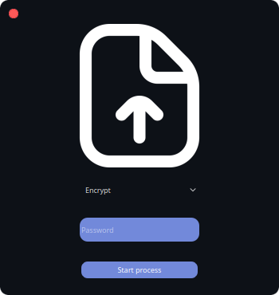

    <h1>🍁 FileEncrypt 🍁</h1>
     
    
    
     <h3>Written in c++ using qt and QCryptographicHash</h3> 
      
    <h3>If you have found bugs in our product or have suggestions, please write about them:</h3>
    
     
    
       
    
      

